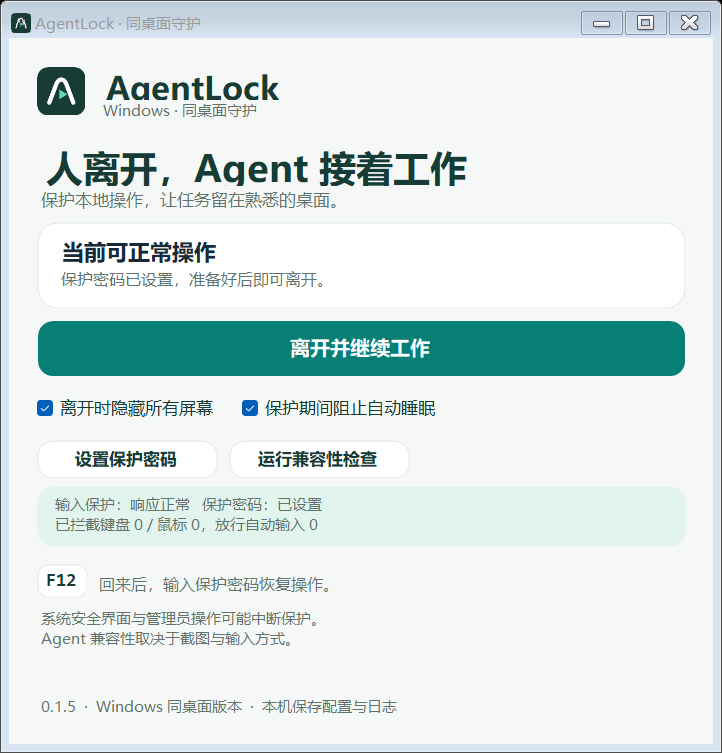

<p align="center">
  <picture>
    <source media="(prefers-color-scheme: dark)" srcset="assets/brand/agentlock-wordmark-dark.svg">
    
  </picture>
  <br>
  <b>人离开，Agent 接着工作</b>
</p>

<p align="center">
  
  
  
  
</p>

---

## 🧠 不想看教程？把下面这段发给任意 AI 助手就行

> **（复制这一段，丢给豆包 / ChatGPT / Claude / 其他任何 AI 助手）**
>
> 请帮我下载并安装 **AgentLock**——一个 Windows 桌面守护工具：让电脑上的 AI 在你离开后继续干活，同时把屏幕遮住、挡住别人的键鼠操作。
>
> 1. 打开 https://github.com/ZephyrChen0754/AgentLock ，下载 **AgentLock-0.1.5-win-x64.zip**（Windows 64 位安装包，在 `release/` 文件夹里）；
> 2. 解压到任意文件夹（例如 `D:\AgentLock`）；
> 3. 双击运行里面的 **`安装到本机.cmd`** 创建快捷方式（也可以直接双击 `AgentLock.exe`）；
> 4. 启动后：① 点「设置保护密码」设一个至少 8 位的密码；② 点「运行兼容性检查」；③ 让我需要的工作开始后，点「离开并继续工作」；
> 5. 回来时按 **F12**（部分键盘是 Fn+F12）呼出密码框，输入密码解锁。
>
> 注意：不要修改、删除 AgentLock 以外的任何文件；不要上传我的密码、文件或截图；如果兼容性检查不通过，告诉我结果就行。

看不懂英文、不想自己点，就把上面的话原样发给你的 AI 助手，它会帮你完成下载和安装。

---

## 这是什么？

**AgentLock** 是一个运行在你 Windows 电脑上的小工具，解决一个很实际的场景：

> 你让 AI（豆包、ChatGPT 等桌面 Agent）帮你跑任务，但你要离开电脑。你担心：**别人偷看屏幕、乱动你的电脑。**

AgentLock 的做法很巧妙——它**不锁屏**（锁屏会让 AI 也停下来），而是：

- 🖥️ **遮住物理屏幕**：旁人看到的是一片遮罩，看不到你的任务内容
- ⌨️ **挡住普通键鼠**：旁人的鼠标、键盘操作被拦截，动不了你的桌面
- 🤖 **放行 AI 的操作**：AI Agent 的截图、点击、输入照常工作，任务继续跑
- 🔑 **F12 一键回来**：你按 F12，输入自己的保护密码，立刻恢复



## 下载

| 版本 | 说明 | 下载 |
| --- | --- | --- |
| **v0.1.5（最新）** | Windows 64 位，免安装 .NET，解压即用 | [⬇️ 下载 AgentLock-0.1.5-win-x64.zip](release/AgentLock-0.1.5-win-x64.zip) |

- 支持：Windows 10 / 11（64 位）
- 不需要安装任何编程环境，不需要管理员权限
- 绿色便携：整个发布文件夹拷到 U 盘也能用

## 三步开始使用

1. **解压 & 安装**：解压 zip，双击 `安装到本机.cmd`（或直接双击 `AgentLock.exe`）
2. **设置密码**：点「设置保护密码」，输入至少 8 位的密码 —— 这是你自己的保护密码，和 Windows 登录密码无关
3. **离开 / 回来**：让任务开始，点「离开并继续工作」→ 屏幕变黑遮罩 → 回来按 **F12** 输入密码解锁

> 💡 第一次使用建议先点「运行兼容性检查」，并用自己的 AI 助手做一次 30 秒的实测，确认遮罩和输入都正常。

## 忘记密码了怎么办？

0.1.5 新增了安全找回流程：

1. 按 **F12** 打开密码框，点 **「忘记密码」**
2. 程序会请求进入 Windows 锁屏，你用 Windows 登录（PIN / 密码 / Windows Hello）解锁
3. 系统确认你本人登录后，会自动弹出**重新设置保护密码**窗口

AgentLock 全程不接触你的 Windows 密码，只核对系统是否真的锁定又解锁。

## 常见问题（FAQ）

**Q：安全吗？会锁死我的电脑吗？**
A：遮罩和输入拦截是普通用户态程序，不是 Windows 原生锁屏的等价物。管理员权限、安全桌面等场景不承诺完全防护（详见下方"工作原理"）。忘记密码有官方找回流程，不会锁死。

**Q：它会偷偷上传我的数据吗？**
A：不会。密码只以加盐哈希保存在本机，不接收、不上传密码、按键内容、截图或文件。

**Q：我的 AI 助手能在保护下工作吗？**
A：取决于 AI 的截图和输入方式。本项目的 GDI 截图、合成键鼠路径已通过基础验证；不同 Agent、设备、多屏需要单独实测（项目里有现成的[实测页面](docs/Agent实测页面.html)）。

**Q：支持触屏 / 平板笔吗？**
A：暂不承诺支持。检测到触屏或笔时会拒绝开启保护，或尝试降级到 Windows 锁屏。

**Q：最小要用多久？**
A：30 秒就能学会，首次完整实测建议 30 分钟以上。

## 工作原理（30 秒版）

```
物理键鼠 ──→ 低级钩子 ──→ ❌ 拦截丢弃（旁人动不了）
AI 合成输入 ──→ 低级钩子 ──→ ✅ 放行（任务继续）
物理显示器 ──→ 全屏遮罩 ──→ 对人不透明，对截图 API 透明
```

- 遮罩窗口使用 `SetWindowDisplayAffinity` 排除于采集，兼容的 Agent 截图看到的仍是原桌面
- 程序带健康探针和 watchdog，检测到异常会尝试转 Windows 原生锁屏兜底
- **边界**：这是普通桌面应用，不是安全内核；管理员、安全桌面（Ctrl+Alt+Del）、Raw Input 等特殊路径不承诺防护

## 给 AI 的完整指令（进阶版）

如果上面的短指令不够用，把下面这份完整版发给 AI 助手：

> 请帮我下载并安装 AgentLock（Windows 桌面守护工具）并完成首次配置：
>
> **下载**：访问 https://github.com/ZephyrChen0754/AgentLock ，从 `release/` 文件夹下载最新版 `AgentLock-0.1.5-win-x64.zip`（Windows x64 自包含包，无需安装 .NET）。
>
> **安装**：解压到任意目录（如 `D:\AgentLock`），运行 `安装到本机.cmd` 创建快捷方式，或直接双击 `AgentLock.exe`。
>
> **首次配置**：
> 1. 点「设置保护密码」，输入至少 8 个字符的密码（用户自行输入，不要让 AI 知道）；
> 2. 点「运行兼容性检查」，等它自动完成；
> 3. 在用户任务开始后点「离开并继续工作」；
> 4. 用户回来后按 F12（或 Fn+F12）输入密码解锁。
>
> **约束**：只操作 AgentLock 自己的文件；不修改、删除电脑上其他文件；不读取、不保存、不上传用户的密码、文件、截图或聊天内容；检查不通过时如实报告结果，不擅自绕过。

## 开发与构建

- 技术栈：C# / .NET 10 / Windows Forms / Win32 API，**零第三方依赖**
- 构建：`.\scripts\Publish.ps1`（会先跑测试，再输出自包含发布包到 `release/`）
- 测试：`dotnet run --project .\tests\AgentLock.Tests\AgentLock.Tests.csproj --configuration Release`
- 测试覆盖：输入策略、密码凭证、恢复授权、心跳文件（0.1.5 共 44 项逻辑测试 + 真实 Windows 登录找回集成验证）

**文档**：[安装与使用](docs/安装与使用.md) · [验收清单](docs/验收清单.md) · [兼容性记录](docs/兼容性记录.md) · [发布说明](docs/发布说明-0.1.5.md) · [视觉设计](docs/视觉设计.md)

## 许可证

[MIT License](LICENSE) © 2026 ZephyrChen0754 —— 可自由使用、修改、商用，保留版权声明即可。
