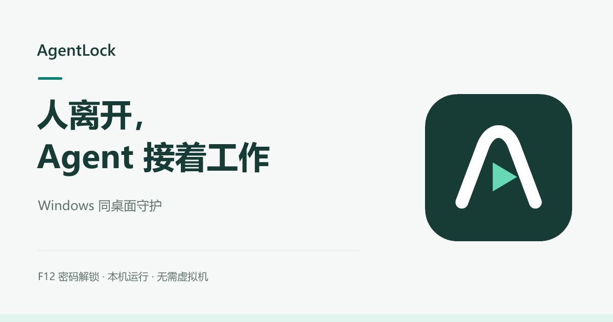

# AgentLock 视觉规范

0.1.4 以清晰、安静的桌面工具为方向：用户能快速确认保护状态，找到主要动作，并记住 F12。视觉调整不改变输入、认证或恢复逻辑。

0.1.5 沿用该视觉规范，并增加 Windows 登录后的忘密恢复入口。首次设置与恢复重设使用不同标题和说明，帮助用户确认当前步骤；恢复功能的验证范围见 [发布说明](发布说明-0.1.5.md)。

## 品牌资产

品牌资产置于 `assets/brand/`，源 SVG 与导出文件一起维护：

标记以保护拱形 / 抽象 A 与向前运行的提示组成，使用深青与薄荷配色。字标已转为完整字形路径，不依赖外部字体；应用图标包含 Windows 常用尺寸。

| 文件 | 用途 |
| --- | --- |
| [agentlock.svg](../assets/brand/agentlock.svg) | 带底色的方形标记 |
| [agentlock-symbol.svg](../assets/brand/agentlock-symbol.svg) | 独立符号 |
| [agentlock-wordmark-light.svg](../assets/brand/agentlock-wordmark-light.svg) | 浅色背景上的标志与名称 |
| [agentlock-wordmark-dark.svg](../assets/brand/agentlock-wordmark-dark.svg) | 深色背景上的标志与名称 |
| [agentlock-512.png](../assets/brand/agentlock-512.png) | 512 × 512 位图 |
| [agentlock.ico](../assets/brand/agentlock.ico) | Windows 应用与快捷方式图标 |
| [agentlock-social-cover.svg](../assets/brand/agentlock-social-cover.svg) / [PNG](../assets/brand/agentlock-social-cover.png) | 1200 × 630 项目分享封面 |
| [brand-preview.png](../assets/brand/brand-preview.png) | 各版品牌资产预览 |

保持比例，不拉伸或拆改符号。标记与文字之间保留空隙，周围至少留出标记宽度的四分之一；小尺寸优先使用符号。README 使用[实际主界面图](images/main-window.png)。分享封面只介绍品牌和核心用途，不充当运行验收证据。

品牌与封面可通过 [render-brand.ps1](../assets/brand/render-brand.ps1) 和 [render-social-cover.ps1](../assets/brand/render-social-cover.ps1) 在 Windows 重建；导出文件与源 SVG 一起维护。

## 颜色与排版

| 角色 | 色值 | 用途 |
| --- | --- | --- |
| Canvas | `#F5F8F7` | 页面与窗口背景 |
| Accent | `#087F75` | 主按钮、标记、必要强调 |
| Ink | `#173C36` | 主标题与正文 |
| Surface | `#FFFFFF` | 状态、选项与认证面板 |
| Mint | `#67D8B4` | 品牌标记内的次级强调 |
| Muted | `#61736D` | 辅助说明 |
| Border | `#DEE8E2` | 面板与次级按钮边界 |

界面使用 Microsoft YaHei UI 与系统字体回退，不依赖下载字体。标题、状态、说明与元信息形成稳定层级；正文不因装饰缩小。长提示允许换行，高 DPI 使用实际缩放验证，不以截图缩放掩盖裁切。

## 界面原则

- 主界面优先展示当前状态与“离开并继续工作”；设置密码和兼容性检查为次级动作。
- F12 和密码说明靠近恢复流程；错误提示明确、可读，状态不能只靠颜色表达。
- 密码窗与设置窗沿用相同配色、间距和标记，保留既有密码操作；“忘记密码”使用次级按钮，避免与“解锁”混淆。
- 遮罩、认证的置顶 / 截图排除、焦点、计时与恢复流程保持原实现，装饰不能遮住操作控件。
- 信息密度与留白优先；不添加营销卡片、虚构安全认证、夸大兼容性的标识。

公开素材只含程序自身界面与测试内容，不含密码、账户、生产日志或个人桌面。
